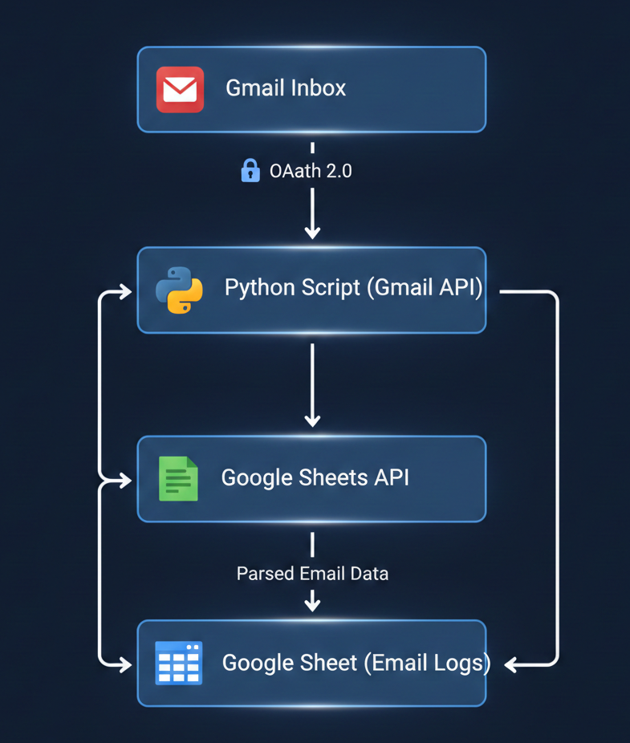

Topic: Gmail to Google Sheets Automation
Author: Mayank Mathur

                                    Project Overview
This project is a Python-based automation system that connects to the Gmail API and Google Sheets API.It reads real unread emails from my Gmail inbox and logs them into a Google Sheet in a structured format.Each email is added as a new row with the following details:

Sender email address
Subject
Date & time received
Email body (plain text)

The script is designed to be idempotent, meaning running it multiple times does not create duplicate entries.

                                       Objective

Fetch unread emails from Gmail Inbox
Parse required email fields
Append data into Google Sheets
Mark processed emails as read
Prevent duplicate processing on re-runs

                                    High-Level Architecture

                                    Setup Instructions

1) Clone Repository 
        git clone <your-repo-link>
        cd gmail-to-sheets

2) Create vitual environment
        python -m venv venv

    Activate: windows, venv\Scripts\activate
              mac , source venv/bin/activate

3) Install dependencies 
        pip install -r requirements.txt

4) Google Cloud Setup
        Create a Google Cloud Project
        Enable Gmail API and Google Sheets API
        Configure OAuth Consent Screen (External)
        Add your Gmail as a Test User
        Create OAuth Desktop App credentials
        Download credentials.json

    place it in : credentials/credentials.json

5) Configure Spreadsheet ID
        Open src/config.py and set: SPREADSHEET_ID = "YOUR_GOOGLE_SHEET_ID"

6)  Run the script
        python -m src.main

                                    OAuth Flow Explanation

OAuth 2.0 Installed App flow is used
User manually grants permission via browser
Access token is stored in token.json
Subsequent runs reuse the token without re-login

                                    Duplicate Prevention Logic

Duplicates are prevented by:
       Fetching only unread emails
       Marking emails as read after processing

Once an email is processed:
        It is no longer unread
        It will never be picked up again

                                    Proof of Execution

Screenshots are available in the proof/ folder:
            Gmail inbox showing unread emails
            Google Sheet populated with logged emails
            OAuth consent screen

A 2–3 minute demo video is also recorded showing:
            Script execution
            Gmail → Sheets data flow
            Duplicate prevention on re-run

                                        Challenge Faced & Solution

Challenge:

Some emails contained very large bodies, causing Google Sheets API to fail due to the 50,000 character per cell limit.

Solution:

Email content is safely truncated to 10,000 characters before insertion, preventing API errors while preserving meaningful data.

                                            Limitations

Attachments are not processed
HTML-heavy emails are handled as plain text
Only Inbox unread emails are considered

                                            Conclusion

This project demonstrates:
          Secure API integration
          Clean Python project structure
          Real-world error handling
          Idempotent automation design

                                    End Of ReadMe
